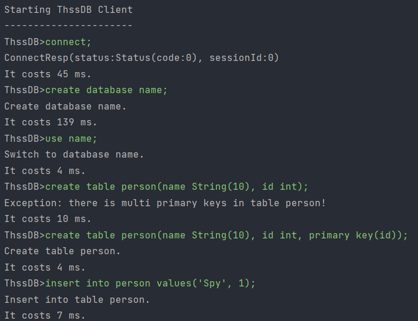
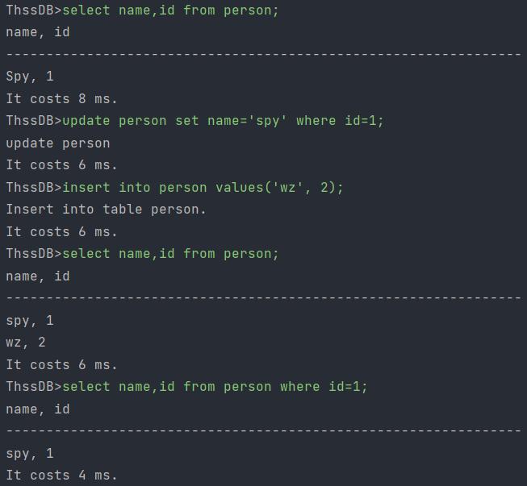
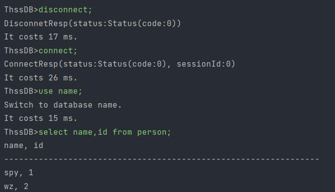
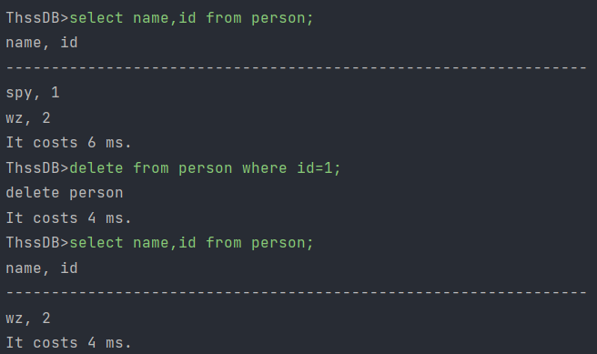
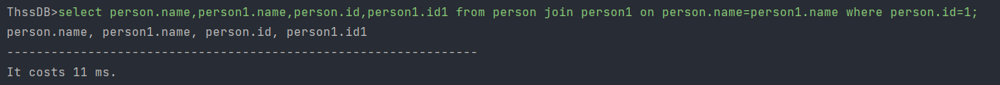
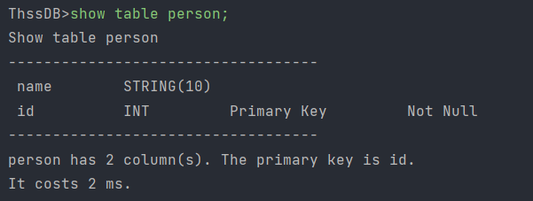
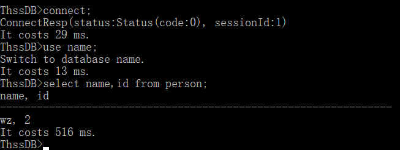
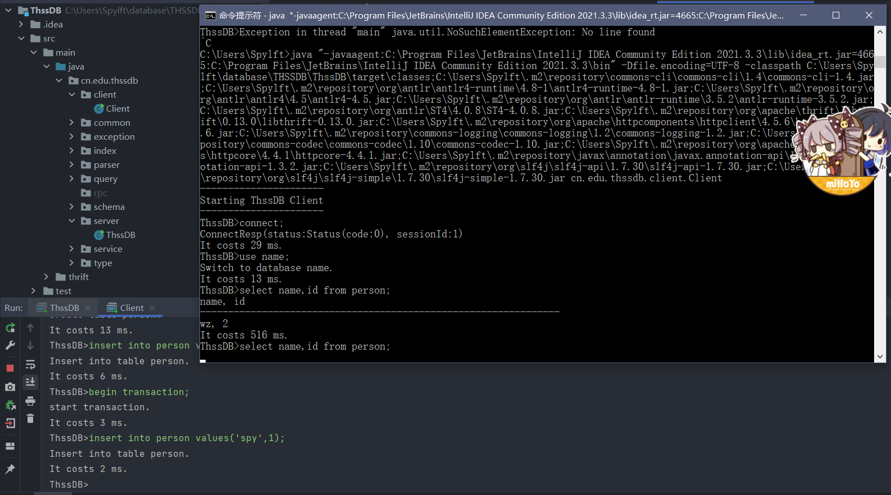
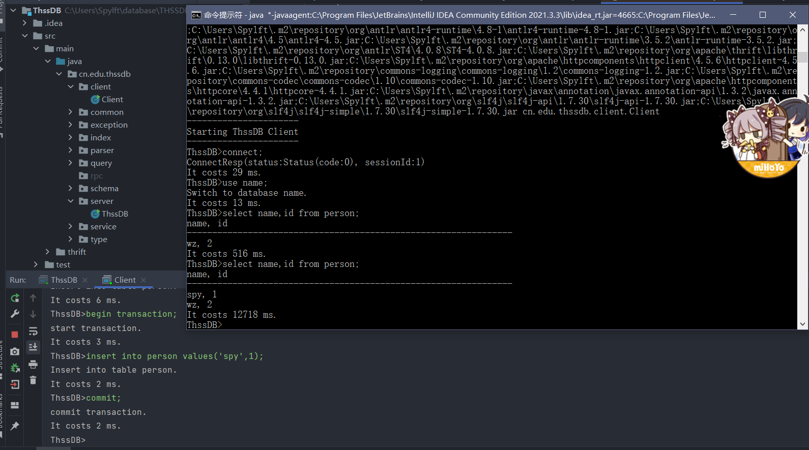
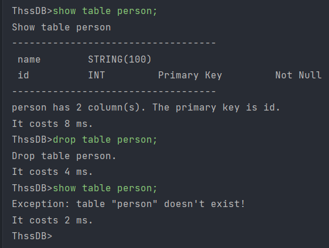

## 数据库原理大作业设计文档

张驰 2018010139

孙沛瑜 2019013284

王政 2019012282

### 完成目标

实现create table语句，可以有多个属性，但是只能有一个主键

实现show table语句

实现insert into语句

实现update语句

实现delete语句

实现select语句，支持join（必须同时有on子句），where，当有两个表进行操作时，所有属性都必须包含表名，即使用全名来操作。

实现事务操作时加锁

实现重启server时能够通过日志文件还原数据

### 实验结果

演示了创建数据库，创建表，插入值的功能

演示了筛选数据，更新数据，插入数据的功能。

演示了关闭server之后重启server，client与server先断开连接再重新连接数据还原

演示了删除表项的功能

演示了join的筛选功能

演示了show table语句

在事务未并发时，能够正常进行访问

在两个client处理事务时，一个事务未提交时，另一个事务无法读取该事务修改过的表的信息

在一个事务提交了之后，另一个事务就能够结束堵塞继续进行了

演示了show table和drop table的功能

### 实现方法

#### SQL语句

##### create table语句

该语句的实现可以分为3部分：

1. 根据visitor获得的语法树对于命令进行解析，获取命令对应的表名、列信息（包括列名，列的种类，列的约束条件not null或primary key）、表格的约束条件信息。
2. 根据解析获得的命令，构造对应的columns（包括列名，列的种类，列是否非空或是否为主键）。
3. 根据获得的结果，使用Database.create指令完成表格创建。

##### show table语句

该语句根据visitor获得的语法树对于命令进行解析，获取命令对应的表名，从数据库中获得该表的metainfo，进行显示。

##### 增加语句

insert into语句的实现可以分为3部分：

1. 根据visitor获得的语法树对于命令进行解析，获取命令对应的表名、输入的列名列表（可选）、输入的元组列表。
2. 根据解析获得的命令，获得输入列名列表在表格中对应的位置，如果没有则默认为表格所有列名。
3. 根据元组列表的结果，对于每个要插入的元组按顺序构造一个Row，使用table.insert指令进行插入。

##### 删除修改语句

update和delete类似，实现可以分为3部分：

1. 根据visitor获得的语法树对于命令进行解析，获取命令对应的表名、筛选的条件where语句、将要修改的值（只有update有）。
2. 根据where语句解析获得的条件，提取出表中满足该条件的Row。
3. 使用table.delete指令进行删除，或者使用table.update指令进行更新。

##### 查询语句

查询语句实现可以分为3部分：

1. 根据visitor获得的语法树对于命令进行解析，获取from命令对应的表名或多个表名及连接方式on、筛选的条件where语句、将要查询的属性。
2. 根据where语句解析获得的条件，提取出表中满足该条件的Row。
3. 对于多表，使用自然连接方法，检验其是否满足对应的on条件，获得满足该条件的Row。
4. 使用QueryTable指令将需要查询的语句及对应的Row进行封装，返回。

#### 事务并发

使用锁机制实现并发功能。

1. 对于每张表格，维护两个变量，Boolean值writeLocked，和int值readLocked分别表示该表格是否被写锁占据和被几个读锁占据（注意到，读锁之间不冲突，所以需要维护int值），并实现表格对应读写锁检测、加锁、解锁方法。
2. 对于读锁，在进行select语句前进行申请，执行完select语句后进行释放。
3. 对于写锁，当收到BEGIN_TRANSACTION指令时，将该客户端的session加入manager.currentSessions，开始维护对应session的x_lockDict即该session用写锁占据的表名列表。当收到COMMIT指令后，将该session占据的写锁依次释放。此时，所有的修改只有在commit之后才能被查看，实现了READ_COMMITED隔离机制。
4. 客户端阻塞机制，当客户端发出的指令需要的锁被占据时，会进入循环，直至该锁被释放才能正常执行语句。此时客户端会进入阻塞状态，而服务器使用多线程方法来避免阻塞。
#### 恢复数据

修改给定代码中的Manager.writeLog，在输出时增加当前的session（用于不同的事务之间进行操作），即同时输出session和操作语句。

当实现恢复时，依次读取每一条语句，执行readLog函数，先提取出session的值，再将session的值和语句一起调用sqlHandler.evaluate函数，使用该函数重新执行该运行语句，使数据库根据日志的内容进行数据恢复。

此处因为evaluate函数中，我们将writeLog的条件修改为了session>=0就进行输出（不同的client会获得不同的值为自然数的session），所以在调用evaluate函数前先将session赋值为了-session-1，这样将其变成了负数，又易于重新恢复原值。